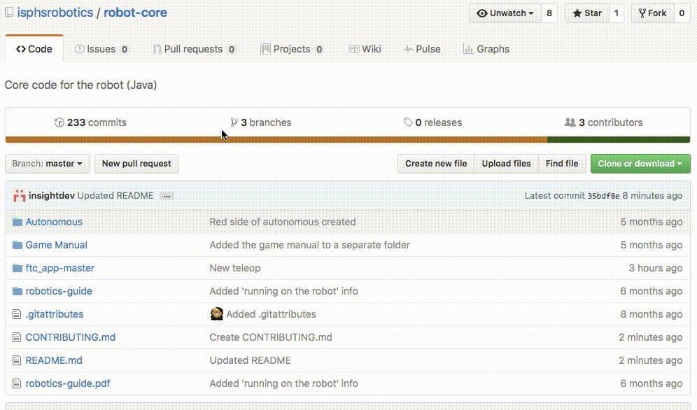

# robot-core - FTC Robotics Prague
----

#  There were some major SDK updates for the new season, please read all READMEs/documentation before pushing to master.

## 00 - Intro

This is the main code repository for the FTC Robotics team at the International School of Prague. This repo contains the main Android Studio project, as well as other team files files.

The main android studio code can be found under /ftc_app_master/. The main programming will be going on under the `opmodes/` folder ([direct link](ftc_app-master/FtcRobotController/src/main/java/com/qualcomm/ftcrobotcontroller/opmodes)), while minor changes will be found in the other folders.

## 01 - How to 'download' this repository

### GUI (Application)

The best (and easiest) way to do this is to first install [Github Desktop](https://desktop.github.com) (also available through Homebrew's Caskroom, if you're familiar with that). Then, go to this repository in your browser ([link here](https://github.com/isphsrobotics/robot-core)), click the green 'Clone or download' button on the right, and click the 'save in Github Desktop' button in the menu (next to 'Download ZIP'). The Github app should open, asking you to save the repository. You can save it wherever you want, but it's best if you keep the name ('clone as') as it is.



### Command-line

You can also open Terminal and type the following commands to get the repository on your computer (the `$` symbol indicates the prompt):

```
$ cd ~/Desktop
$ git clone https://github.com/isphsrobotics/robot-core.git
```

## 02 - Contributors with push access

* @isphsrobotics
    * This is the account used on school computers. Any robotics member can use it, however usually it is used by Alex (insightdev).
* @insightdev
    * Alex
* @DanielHamill
    * Daniel
* @champaru
	* Roman

## 03 - Where stuff is

###### Guide to Robotics
Alex wrote a (albeit very basic) guide to how all of this works, you can find it in the root directory of the repo. The file is called robotics-guide.pdf. You can also [follow this link](https://github.com/isphsrobotics/robot-core/blob/master/robotics-guide.pdf).  
Feel free to edit it if you know LaTeX.

###### Bugs, issues, and checklists
This will be found under the Issues tab in github (press `g` `i`)

###### Other links

* [This year's challenge](https://www.youtube.com/watch?v=iQLrcQbm8cg)
* [Official FTC SDK (Github)](https://github.com/ftctechnh/ftc_app)
* [FTC subreddit](https://www.reddit.com/r/ftc)
* [Incremental servo movement code snippet](https://gist.github.com/insightdev/9ec8d15a31d9c179d5895650be30d060)
* [How to use the color sensor](https://github.com/ftctechnh/ftc_app/blob/master/FtcRobotController/src/main/java/com/qualcomm/ftcrobotcontroller/opmodes/HTRGBExample.java)

## 04 - Contributing

If you want to contribute, please read the [CONTRIBUTING](CONTRIBUTING.md) document.

----
:copyright: *International School of Prague FTC Robotics Team 2016-2017. All rights reserved*
